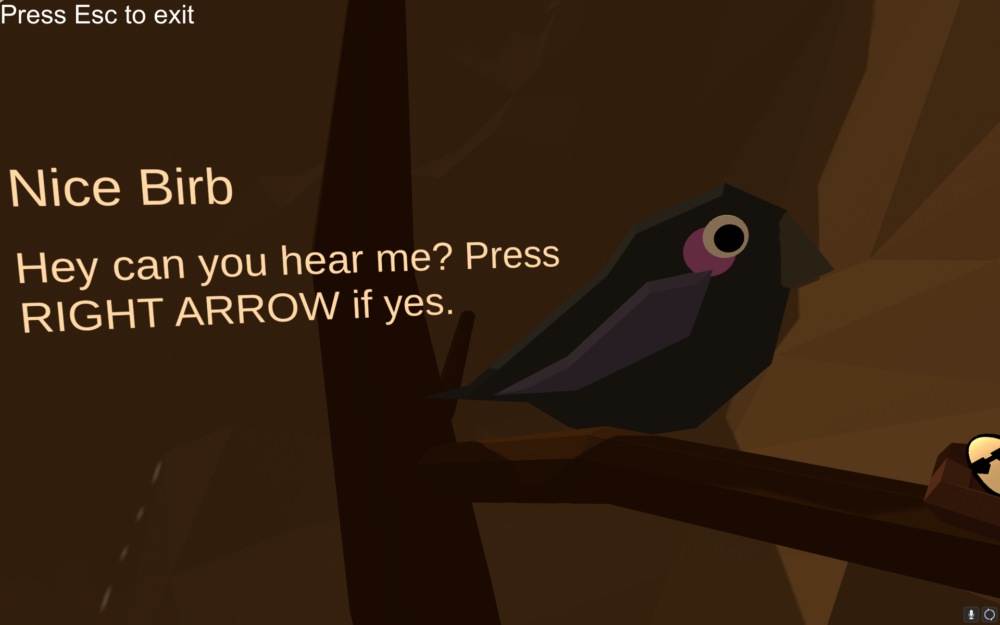
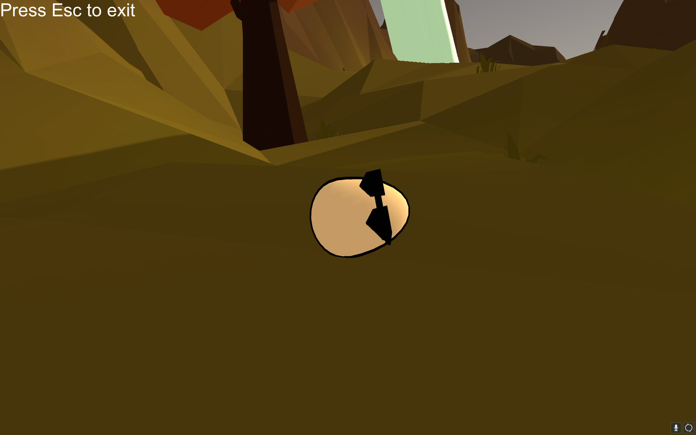
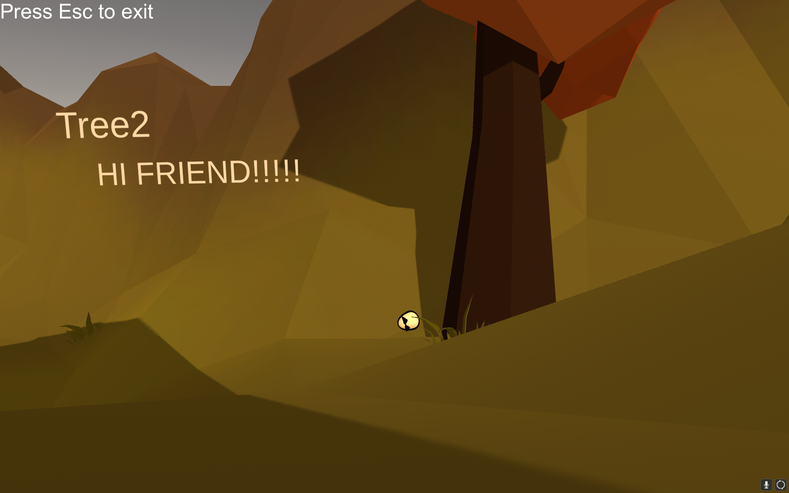
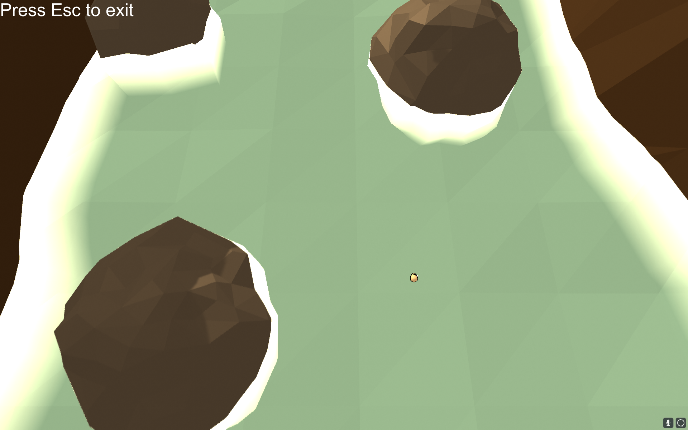
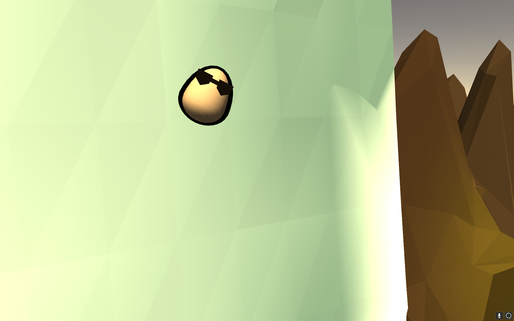

# the-egg-game

## Description

In collaboration with my friends, this game was developed in 2021 as our final project for a programming course. It tells the captivating story of an (un)usual egg that, against all odds, survives a fall from its nest. Now, the egg embarks on an adventurous journey to explore the world. The game draws inspiration from the imaginative music video [Exyl - Egg](https://www.youtube.com/watch?v=114rxHa0qzo)

## Features

Though the game is really short, it features:

- Scenic landscape
- Several changes, such as a mountainous river
- Dialogue system
- Several cutscenes

## Installation

### The built of the game can be found on [GameJolt](https://gamejolt.com/games/theegg/622525).
### However, if you need the unbuild project installed, you should follow these steps:

### 1. Clone or Download the Repository

### 2. Open the Project with Unity Hub

1. Open **Unity Hub**.
2. Click on the **Projects** tab.
3. Click the **Add** button (located on the top right).
4. Navigate to the cloned project directory and select it.
5. Make sure to select the correct Unity version (2019.4.13f) if prompted.

### 3. Install Dependencies

Unity should automatically detect and import all the necessary packages. If there are any issues, follow these steps:

1. Open the project in **Unity Editor**.
2. Go to **Window > Package Manager**.
3. Ensure all required packages are installed. If not, install them manually.

### 4. Resolve Missing References

Since the `.gitignore` for Unity might exclude some large files or auto-generated files, ensure all necessary files are included:

1. Check if there are any missing references or broken links in the project.
2. Re-import assets if necessary: Right-click on the `Assets` folder in the Project window and select **Reimport All**.

### 5. Run the Project

1. Ensure all scenes and assets are properly imported.
2. Open the LVL1 scene.
3. Click the **Play** button at the top of the Unity Editor to run the game.

## Screenshots

### Dialogue in Nest:

### On the Ground:

### Talking with a Tree:

### Mountainous River:

### Falling Cutscene:

## Teaser
https://www.youtube.com/watch?v=THjh54CVDWw
